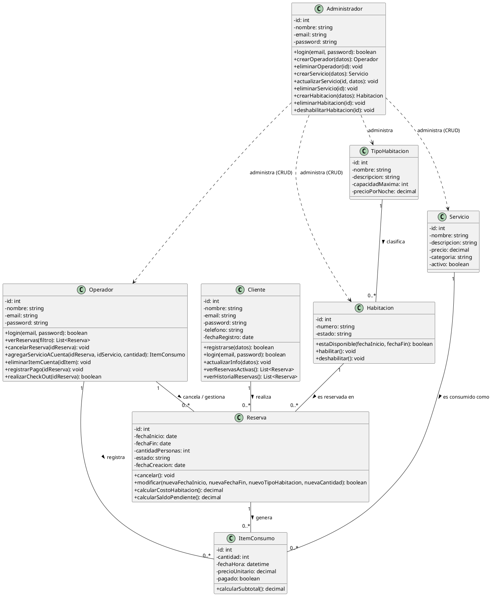

# Modelo de Clases

## Diagrama de Clases

Este diagrama representa la estructura principal del sistema de hotel para el proyecto The Royale. Se organiza en tres roles principales: el cliente, que realiza reservas; el operador, que gestiona reservas, consumos y pagos; y el administrador, que administra habitaciones, servicios y personal.

La relación entre `Cliente` y `Reserva` muestra que un cliente puede tener muchas reservas, mientras que cada reserva está asociada a una habitación y puede generar varios consumos. `Habitacion` y `TipoHabitacion` definen la disponibilidad y el costo de la estancia, y `Servicio` e `ItemConsumo` permiten registrar los servicios adicionales dentro de la cuenta del huésped.

El diagrama también refleja el flujo operativo del hotel: el operador puede cancelar reservas, registrar pagos y realizar check-out, mientras que el administrador mantiene la configuración del sistema y del inventario del hotel.

